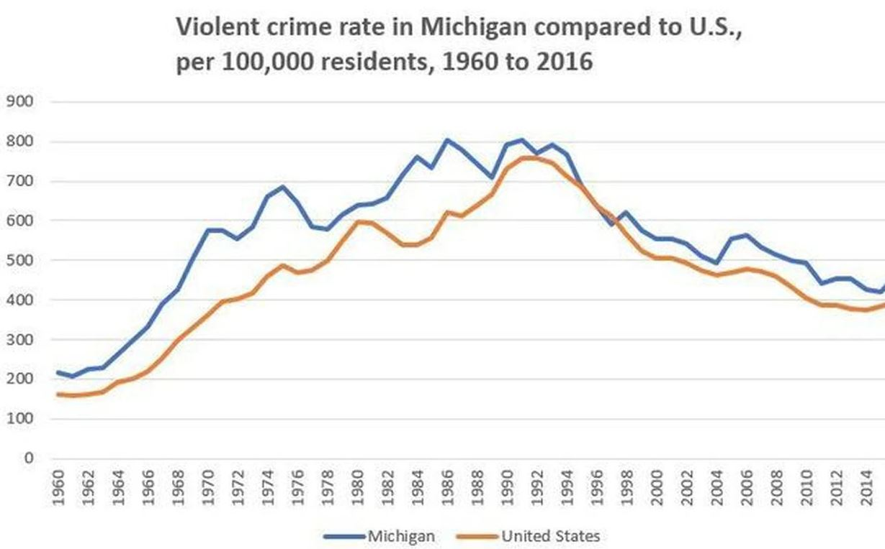

```{r setup, include =FALSE}
knitr::opts_chunk$set(
  echo = TRUE,
  error = TRUE,    # display errors but keep going.
  comment = "",    # don't add '##' characters before output.
  message = FALSE  # don't include messages in the knitted output (check them in RStudio)
  )
library(tidyverse)
library("stringr") 
theme_set(theme_bw())
```

## Overview

An article was published on mlive.com analyzing crime in the state of Michigan and takes a close look at the trends of crime in the state from 1960 to 2016. The article also compared some of these statistics to the US average as a whole. Specifically, this project will analyze violent crime rate per 100,000 residents for the US and the state of Michigan.

The article can be found here:
[mlive](https://www.mlive.com/news/2017/09/michigan_crime_trends_since_19.html)



Above is the original visualization that we will be analyzing from the article that claims that "Michigan's violent crime rate generally trends above the national average."

## Design

The visualization is a line chart with the years 1960 through 2016 on the x-axis and the violent crime rate per 100,000 people on the y-axis. Two separate lines were plotted, one for Michigan and one for the US, that way they can be compared. It makes sense that the author would choose a chart like this as it makes it easier to see trends throughout time and to compare the two plots.

Color was used to represent each line, one for Michigan and one for the United States. Position was used to represent the number of violent crimes over time. A y-axis grid line was used to be able to read the values of the plot.

The way color was used was definitely appropriate as it makes it easier to see the difference between the number of violent crimes per 100,000 people over time; it creates a distinction between the two lines that is easy for the eye to see.

Overall, this visualization is effective in what its main goal is: to show the difference in number of violent crimes per 100,000 people in Michigan as opposed to the United States. This plot has some weaknesses in its labels and axes; the years are shown vertically which makes it slightly harder to read. It is understandable that they chose to do this so that you can see each year without them overlapping, but it may be more effective to have less of the years shown, but still shown horizontally. The plot is also missing x and y axis labels, and although these are clearly stated in the title, we think the title needs some work as well; the title should be more concise.


## Data

### Data Overview

The source of data for these graphs was not provided through the article, but we found data that we expect to match as it is the same crime report. This could be the data set that was used for this visualization, but it may be a slight variation as they did not specify if they used the Violent crime count from disastercenter.com. 

We found two separate sources of data for Michigan and the United States on distastercenter.com. These data sets have information on crime including populations, violent crime rates, and years from 1960-2019. Below are the links to data.

For Michigan: [Michigan Data Link](https://www.disastercenter.com/crime/micrime.htm)

For the United States: [Usa Data Link](https://www.disastercenter.com/crime/uscrime.htm)
  
We copied and pasted the data from the links above to an excel file so that we would be able to use the data. 

This data that we have used from disastercenter.com was taken from data published from the Bureau of Justice Statistics. Therefore, this is public data posted about the nation that citizens, or really anyone, can use.

### Data Details


```{r load-data}
# Load the Data
mi_crime <- read_csv("MichiganCrime.csv")
usa_crime <- read_csv("USCrime.csv")
```

Both of these datasets have 60 observations (one for each year) of 12 variables. The variables (columns) include the year, population, and then different types of crimes committed. One dataset contains this data for Michigan and one for the entire United States, and both contain the data for the years 1960-2019.

A single row represents the number of crimes for each of the types of crimes in a single year, and the population in that year. For example, a row might represent that in Michigan in 1960, the population was 7,823,194 with a crime index of 208,035, and there were 353 instances of murder, 17,034 instances of violent crimes, etc.

There are `r nrow(mi_crime)` rows in the Michigan dataset and `r nrow(usa_crime)` in the United States dataset, one for each year.

The data provides the crime index, but the graphic we are replicating contains crime per 100,000 population, which the data does not provide. We will have to add a column to include that. The data also provides information on the number of several different crimes over the years 1960 to 2019. However, we will only be looking at the data up to 2016 to replicate the claim and plot. With what the data does provide, it might be interesting to know the differences in crime rates between just Michigan and the entire United States.


### Wrangling

To start, we need to combine the datasets into one. This will require distinguishing the two datasets by area: Michigan and USA. Then we will make sure the data is in ideal form and then select the necessary columns to create the plot. Lastly, to recreate the plot, we need to create a new variable to convert the crimes to a crime rate (crimes per 100,000 residents). We could also filter the data for only the years 1960-2016 (because that is what their plot includes), but it does not hurt to leave those extra three years on our plot to further understand the trends.

Here, we will add a variable called "Area" to both datasets to distinguish between the Michigan and United States data when we join them.

```{r}
# Adding an area variable
mi_crime <- mi_crime %>% 
  mutate(Area = 'Michigan')

usa_crime <- usa_crime %>% 
  mutate(Area = 'USA')
```

Here we are merging (or joining) the two datasets into one.

```{r}
# Joining the datasets
crime <- full_join(mi_crime, usa_crime)
```

For our replication, we are only interested in the year, the area, the population, and the number of violent crimes, so let's select those columns of our data.

```{r}
# Selecting only Necessary Variables
crime2 <- crime %>% 
  select(Year, Violent, Area, Population)
```

In order to create a Per Thousand variable (which will be done next), we need Population and Violent Crimes values to be numeric. To do this, we need to remove all leading/trailing spaces and all commas.

```{r}
# Remove Commas and Spaces
violent <- str_remove_all(crime2$Violent, ",")
violent2 <- str_trim(violent, "both")
pop <- str_remove_all(crime2$Population, ",")
pop2 <- str_trim(pop, "both")
year <- str_trim(crime2$Year, "both")

# Make Population and Violent Crimes Numeric
crime2 <- crime2 %>% 
  mutate(Population = as.numeric(pop2)) %>% 
  mutate(Violent = as.numeric(violent2)) %>% 
  mutate(Year = year)
  
```

Let's create a new variable, calculating the number of violent crimes per one hundred thousand people. This will help us to replicate the graphic.

```{r}
# Create Per One Hundred Variable
crime2 <- crime2 %>% 
  mutate(perHundredThousand = ((Violent / Population) * 100000))
```

## Replication

```{r}
crime2 %>% 
  ggplot() +
  aes(x = as.numeric(Year), y = perHundredThousand, color = Area) +
  geom_line() +
  labs(title = 'Violent Crime Rate in Michigan Compared to U.S.', 
       x = 'Year', 
       y = 'Crimes Per One Hundred Thousand')
```

The main difficulties we encountered so far on this project were in the wrangling process. We had to remove spaces and commas from the data that kept causing issues. When it comes to the plot, there were minimal issues, and replicating it was pretty straight forward. We did have to change the Year variable to numeric so that labels looked better and there were not any issues on the x axis.

The only difficulties we have yet to overcome is creating an alternative design, since the plot we chose was already a good representation of the data. When it comes to making alternative designs, we thought it would be best to expand on the exploratory data analysis and look at other comparable variables such as other states and crime types.


## Alternatives

Our original visual chooses to compare the number of crimes per 100,000 people over time between Michigan and the United States. It distinguishes the Michigan line and the U.S. line with color and uses position as a visual cue.

### Alternative 1: Separate Violent Crimes

Our first alternative design will make very different visual cues than the original, and it will expand upon the analysis by separating the violent crimes into the four different categories: Murder, Forcible Rape, Robbery, and Aggravated Assault. While the original chose to do more positional cues using a line graph to compare the differences, we will use more length or area cues by using a bar graph to compare the differences. Since we are adding several more variables, this will make it easier to compare the difference between Michigan and Unites States crimes by each different category. So instead of having 8 different lines on a graph, we will have 4 facets for each crime type with a bar for both Michigan and the U.S. The only difference is that this one would not account for the Year variable.

This change will now support a more detailed claim, answering whether the United States or Michigan has higher crime rates for each of the four types of violent crimes. We expect that it will support a similar claim and that Michigan will have higher rates in all four categories, but maybe one category (like murder) is especially higher and another is especially lower, then maybe we can think about the reasons why that might be. 

### Alternative 2: Comparing the Violent Crimes between other States

Our second alternative design will make similar visual cues as the original, but expand upon the analysis by comparing the number of violent crimes per 100,000 people in other states. For this, we will have to include more data, and we will compare Michigan and the United States again but with Illinois and Ohio as well. We chose these states because Illinois is another state that has high crime cities such as Chicago similar to Detroit in Michigan. We chose Ohio because it is another Midwest state with similar culture to Michigan, but without the renowned high crime cities like Chicago and Detroit. We find it interesting to compare such states and see what states have higher violent crime rates.

This change affects how the visual supports the claim because it will expand on the analysis, by possibly supporting multiple claims about the differences between each of the states with each other and the United States as a whole. 

### Implementation: First Alternative

To do our first alternative design, we must do more wrangling. This is similar wrangling to what we have done earlier, but with more variables. Therefore, it is not necessary show all of the wrangling code chunks in our knitted file.

```{r, warning = FALSE, echo = FALSE}
# Selecting only Violent Crimes (separately)
crime3 <- crime %>% 
  select(Year, Murder, `Forcible Rape`, `Aggrevated Assault`, Robbery, Area, Population)

# Remove Commas and Spaces, like earlier
murder <- str_remove_all(crime3$Murder, ",")
murder2 <- str_trim(murder, "both")
robbery <- str_remove_all(crime3$Robbery, ",")
robbery2 <- str_trim(robbery, "both")
forcible <- str_remove_all(crime3$`Forcible Rape`, ",")
forcible2 <- str_trim(forcible, "both")
aggrevated <- str_remove_all(crime3$`Aggrevated Assault`, ",")
aggrevated2 <- str_trim(aggrevated, "both")
population <- str_remove_all(crime3$Population, ",")
population2 <- str_trim(pop, "both")
year <- str_trim(crime3$Year, "both")

# Make Population and Violent Crimes Numeric
crime3 <- crime3 %>% 
  mutate(Population = as.numeric(population2)) %>% 
  mutate(Robbery = as.numeric(robbery2)) %>% 
  mutate(Murder = as.numeric(murder2)) %>% 
  mutate(`Forcible Rape` = as.numeric(forcible2)) %>% 
  mutate(`Aggrevated Assault` = as.numeric(aggrevated2)) %>% 
  mutate(Year = year)
```

Let us attempt to create the alternative design, separating by the different violent crimes:

```{r, warning = FALSE}
# Create Per One Hundred Variable for each Crime
crime3 <- crime3 %>% 
  mutate(Murder = ((Murder / Population) * 100000)) %>% 
  mutate(`Forcible Rape` = ((`Forcible Rape` / Population) * 100000)) %>% 
  mutate(`Aggrevated Assault` = ((`Aggrevated Assault` / Population) * 100000)) %>% 
  mutate(Robbery = ((Robbery / Population) * 100000)) 

# Rename Misspelled Column Names and Pivot
crime3 <- crime3 %>% 
  rename(`Aggravated Assault` = `Aggrevated Assault`) %>% 
  pivot_longer(-c(Year, Population, Area), names_to = 'Crime', values_to = 'Number')

# Create the Plot
crime3 %>% 
  ggplot() +
  aes(x = Area, y = Number, fill = Area) +
  geom_col() +
  facet_wrap(~Crime, scales = "free") +
  labs(title = 'Rate of Different Violent Crimes in Michigan Compared to U.S. from 1960-2019', 
       x = 'Area', 
       y = 'Crimes Per One Hundred Thousand')
```

Here are the bar graphs of the four different violent crimes' rates in Michigan compared to the United States. The y-axis scales are free to optimize visibility of the differences of a certain crime between Michigan and the U.S.

From this graph, we can conclude that Michigan has had higher crime rates in each of the four violent crime categories from the years 2016-2019. Michigan's crime rate is especially greater in the Forcible Rape category. This expands upon the claim that Michigan's violent crime rate generally trends above the national average because now we can say that this is true in all four categories of violent crimes: Murder, Aggravated Assault, Forcible Rape, and Robbery.

# The Implementation of the Second Alternative is on the HTML

## Summary

Now that we have replicated a line chart similar to the one published about Michigan's violent crime rate, but with data from another source, we have confidence in mlive.com's claim that "Michigan's violent crime rate generally trends above the national average." Both line charts showed that Michigan's annual violent crimes per 100,000 people was typically above that of the U.S. and the trend from the data was well represented in the original plot. In addition, by breaking down the violent crimes into the four categories (murder, forcible rape, robbery, and aggravated assault), we confirmed that Michigan's rate per 100,000 residence for all four categories is higher.

Our replication was very similar to the one produced. The main idea is the same, but there were some differences such as a different data source and axis labels. We added a y-axis to make it more clear about the chart while the plot from mlive.com did not label the y-axis, but rather had a longer title. In addition, our x-axis label was every 20 years to keep it clean, while the x-axis on the mlive.com was every other year which made it very busy. We also had grid lines from both axes to help read the plot, while the mlive.com one only had y-axis grid lines. Ultimately, the lines were very similar and both supported the claim that "Michigan's violent crime rate generally trends above the national average." 

Since our replication was the best way to visualize the data, we chose alternative designs that helped to see other trends within the data. For example, we further explored the four different crime categories that make up violent crimes. We compared the sum from each year from 1960 to 2019 per 100,000 persons. This clearly showed that in all four categories Michigan was above the national sum. This was something that could not be seen from the line plot. 

In our second alternative design, we compared it to the trends of Illinois and Ohio, two other states in the Midwest. It was very interesting to see that Ohio was always less than the national average for violent crimes per 100,000 persons. However, Illinois, the state with a high crime city, Chicago, was similar to Michigan's trend from 1960 and 1980. Illinois was typically above the US average as well. Throughout the 1990s, it spiked even above Michigan's rate which is very interesting. Throughout the 2000s, Illinois rate became comparable to Michigan's again, because it dropped. 

For potential future analysis, we would like to break down the crimes in Michigan even more and see if the majority of the crimes were on the eastern side of the state, near Detroit. It could also be interesting to compare all of the states. It is very interesting how crime spiked throughout the 1990s, especially in Illinois. 

Overall, this experience was enjoyable as we got to find trends in the data that our original plot did not show. The data wrangling process was exciting and frustrating at the same time, as we had to figure out some little things that were possibly messing with column or value names. Although we ultimately decided on the plots that we did, it was fun to mess around with making different plots and changing things slightly, especially for our first alternative design, as we looked at it as a line graph and a bar graph, tried faceting by different variables, different color variables, etc. It was interesting to see the story that our data was telling and expand a lot, and we overall learned a lot about wrangling, coding, and Michigan crime through this experience.

